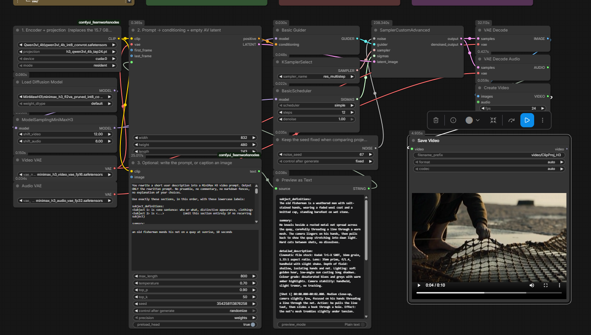
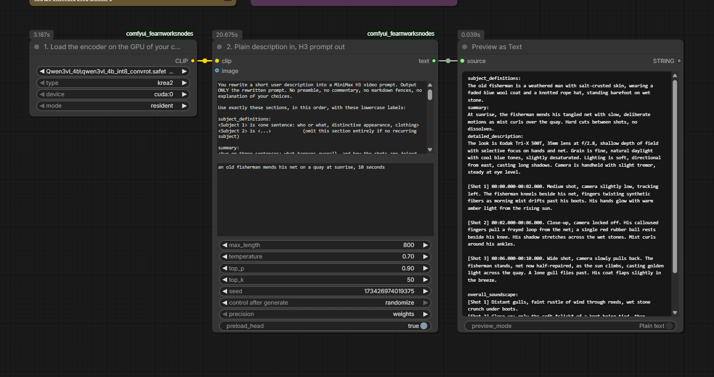
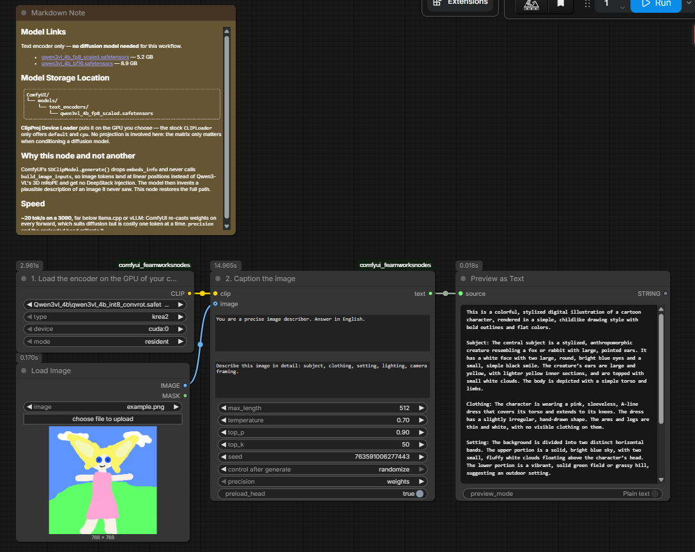

# ComfyUI-ClipProj

**Swap a large text encoder for a small one, with a learned linear projection.**

**Version 0.1.0**

> ## ⚠️ Proof of concept — working, but a proof of concept
> **It runs and it produces good video**, and every number below was measured on real hardware rather than estimated. It is still a proof of concept, not a finished product: built and tested on a single setup — **Windows 11, NVIDIA, ComfyUI 0.31.0** — with deliberately limited exploration. Expect rough edges and breaking changes. **Use at your own risk.**

Diffusion models spend a lot of VRAM on their text encoder. MiniMax H3 uses a **Qwen3-VL-32B** truncated to 50 layers — **15.7 GB in NVFP4** — solely to turn a prompt into a `[seq, 5120]` conditioning tensor.

ClipProj replaces it with a **Qwen3-VL-4B** (2560 dims) plus a learned linear map into the 5120-dim space the DiT expects:

```
cond = ((h - mean_in) / std_in) @ W * std_out + mean_out
```

**15.7 GB → 4.5 GB** with the int8_convrot encoder (8.3 GB in bf16, 5.2 GB in fp8). The DiT, the VAEs and the sampler are untouched: the node returns an object that behaves like the official CLIP, so it drops into the existing `clip` input with no rewiring.



*The complete pipeline — encoder, projection, conditioning, sampling, decode and video output. `examples/minimax_h3_clipproj.json`*

## Installation

```bash
cd ComfyUI/custom_nodes
git clone https://github.com/nicolab28/ComfyUI-ClipProj
```

Restart ComfyUI. **There is no `requirements.txt` and nothing to `pip install`** — the nodes import only `torch` and ComfyUI's own modules, all already present in any working installation.

On first launch the folder `ComfyUI/models/clip_projections/` is created. Put the projection matrices there (see *Models and matrices* below).

Example workflows are in `examples/`: drag any `.json` onto the ComfyUI canvas.

### Tested on

| | |
|---|---|
| OS | **Windows 11** — Linux and macOS should work but were not tested |
| GPU | NVIDIA (RTX 3090 / 4070 / 3060). Not tested on AMD or Apple Silicon |
| ComfyUI | 0.31.0 |
| PyTorch | 2.13.0 + CUDA 13.0, Python 3.13 |

The package is declared `OS Independent` because nothing in the code is platform-specific: no absolute paths, no `win32` calls, no hard-coded separators. Only the *testing* happened on Windows. If you run it elsewhere and hit a problem, that is a bug worth reporting rather than an expected limitation.

## Why it works

The 4B and the 32B share the **same tokenizer** (151936 tokens): a prompt yields the same tokens at the same positions in both. That makes a position-by-position mapping between their hidden states learnable — there is no alignment problem.

Calibration is **ridge regression**, not training. No gradients, no epochs, no learning rate. Encode N prompts with both models, accumulate `XᵀX` and `XᵀY` in streaming (constant memory), solve.

## Measured results

MiniMax H3, tap 24 of 36, Seedance prompt corpus:

| Corpus | Tokens | Cross-prompt CKA | Test cosine | Test R² |
|---|---|---|---|---|
| 200 prompts | 37 361 | 0.95 | 0.699 | 0.490 |
| 2 000 prompts | 288 608 | 0.92 | **0.712** | 0.507 |

Eight times the data buys 1.8 % of cosine: **the linear projection is at its ceiling**, not starved of data. Going further needs an MLP, not more prompts.

A cosine of 0.71 sounds poor and **is not** — the DiT tolerates far more than the metric suggests. What holds up in actual generation:

- simple prompts ✅
- structured multi-shot prompts (`subject_definitions`, timecoded shots, `overall_soundscape`) — four distinct cuts, no bleed between them ✅
- **fl2va with first and last frame** ✅, although `W` only ever saw text positions
- robust to swapping encoder weights: a `W` calibrated on bf16 works on an abliterated fp8 variant, and on `int8_convrot` — whose rotation turns out to be compensated, so the activations stay in the expected frame

## Known limitations

The 4B holds up **well enough** on everything tried so far — but the trials were not pushed far, and the honest summary is that **you lose knowledge the 32B has**.

**Named references disappear.** Some real people come through, others do not: in testing, one well-known actor rendered correctly while another was simply absent, replaced by a generic figure. The same almost certainly applies to landmarks, artworks, brands, film styles and any other named reference — a 4B stores far fewer facts than a 32B, and no projection can restore knowledge that was never encoded in the first place. We did not map which references survive; assume any proper noun is at risk.

Whether this is the small model's ceiling or something the matrix loses is still open. A quick test settles it for a given name: ask the encoder itself, in plain text, to describe that person or place. If the answer is vague, the knowledge is not there and no better matrix will help.

**Other known gaps:**

- **ref2va** (video / audio references) is untested and refused by the node
- image references work in **fl2va**, but `W` was calibrated on text positions only, so vision positions are projected out of their training distribution
- the linear projection is **at its ceiling**: eight times more calibration data bought 1.8 % of cosine. Going further needs an MLP, not more prompts

## Control matrices — run these first

Three synthetic matrices are selectable in the node. They exist to prove that `W` is doing the work rather than the diffusion model.

| Control | What it does | Output for *"a red ball on a wood table"* |
|---|---|---|
| `<control:zero>` | `W = 0`, constant conditioning | a countryside landscape — prompt entirely ignored |
| `<control:identity>` | raw copy of the 2560 dims, no learning | a golden object in flames — unusable |
| learned `W` | the calibrated projection | the red ball on a wood table |

`‖W_identity‖ = 50.6` vs `‖W_learned‖ = 52.4` — near-identical energy, so the difference is purely structural. **Always run these controls before trusting a new projection.**

## Nodes

| Node | Purpose |
|---|---|
| **ClipProj Device Loader** | loads any text encoder on a chosen GPU, without projecting |
| **ClipProj Apply** | projects an already-loaded CLIP, like a LoRA |
| **ClipProj Loader (all-in-one)** | loads a small encoder on a chosen GPU and projects it |
| **ClipProj Generate / Caption** | text generation and image captioning on the **same resident weights** |
| **ClipProj Free VRAM** | releases pinned encoders on demand |

The stock `CLIPLoader` only offers `default` and `cpu` for its device, so there is no way to target a specific card on a multi-GPU machine. That is why the loaders exist.

`Generate / Caption` exists because ComfyUI's `SDClipModel.generate` drops `embeds_info` and never calls `build_image_inputs`: image tokens end up at linear positions instead of Qwen3-VL's 3D mRoPE and without DeepStack injection, which makes captioning fail. This node restores the full path.



*"an old fisherman mends his net on a quay at sunrise, 10 seconds" in, a full three-shot H3 prompt out. `examples/rewrite_h3_prompt.json`*



*Image captioning, no second model loaded. `examples/caption_image.json`*

Generation is **far slower than a dedicated engine** (llama.cpp, vLLM). ComfyUI's ops re-cast weights on every forward — sound for diffusion, costly when decoding one token at a time. Two mitigations are exposed (`precision`, `preload_head`); expect around 20 tok/s on a 3090. For heavy use, prefer a real inference server.

## Models and matrices

**This repository ships no model weights.** They stay with their authors — download them from the official sources below and point the node at them.

| Role | Where | Licence |
|---|---|---|
| **Projection matrices** | **[NicoLab28/ClipProj-MiniMax-H3](https://huggingface.co/NicoLab28/ClipProj-MiniMax-H3)** | MIT |
| Diffusion model + VAEs | [Comfy-Org/MiniMax-H3](https://huggingface.co/Comfy-Org/MiniMax-H3) | custom |
| Text encoder (small) | [Comfy-Org/Krea-2](https://huggingface.co/Comfy-Org/Krea-2) — `text_encoders/qwen3vl_4b_*` | Apache 2.0 |

The matrices go in `models/clip_projections/`. Each `.pt` records the model it was calibrated on, but any variant of matching output dimension will load — including quantised or fine-tuned ones.

The 32B text encoder is **no longer needed**, which is the entire point.

## Calibrating your own

The method is not specific to MiniMax H3. It applies wherever a large text encoder has a smaller sibling **in the same family**. Qwen3-VL ships in 2B, 4B, 8B, 30B-A3B, 32B and 235B-A22B, all sharing one tokenizer — so any pair among them is a candidate:

- Flux 2 / Klein — Mistral3-24B pruned
- Ideogram4, Boogu, JoyImage — Qwen3-VL-8B, replaceable by the 4B or 2B

Two requirements: an **identical tokenizer** between the two models, and handling multi-layer taps when the target consumes a stack rather than a single layer.

See `calibration/`:

| Script | Purpose |
|---|---|
| `probe.py` | CKA probe — is the information even present? Run before anything else |
| `run.py` | full calibration, produces the `.pt` |
| `make_controls.py` | builds the zero / identity control matrices |
| `test_node.py` | end-to-end check without launching ComfyUI |

Two traps worth knowing, both of which cost real time to find:

1. **Massive activations.** Token 0 (the attention sink) and 5–14 dimensions out of 5120 carry values hundreds of times the standard deviation. Left alone they saturate any linear similarity measure — CKA reads 0.9999 across twenty consecutive layers and means nothing. Drop the sink and standardise per dimension.
2. **Lexical identity.** CKA measured *within* a prompt is inflated by both models sharing a tokenizer. Measure **across prompts** (one mean vector per prompt).

## Credits

Vibe-coded with **Anthropic Claude Code (Opus 5)** — design, implementation, calibration scripts and this README. Every number quoted above was measured on real hardware, not estimated: where a prediction turned out wrong, the measurement won and the text was corrected.

## Licence and responsibility

The **code** in this repository is MIT (see `LICENSE`).

Everything else is not ours, and using it is your responsibility:

- **Qwen3-VL** is published by Alibaba under **Apache 2.0**. Read and comply with its terms and acceptable-use policy.
- **MiniMax H3** ships under a **custom licence** (`license: other` on Hugging Face). Read it before any use, particularly commercial.
- **Projection matrices** are derived from the activations of both models. Their legal status is unclear. They are provided as-is, for research, with no claim of ownership over anything derived from the underlying models.

This project is **not affiliated with, endorsed by, or connected to** Alibaba / Qwen, MiniMax, or Comfy Org. All trademarks belong to their respective owners.

You remain responsible for what you generate and for complying with the licences of every model you load. The authors accept no liability for any use of this software.
